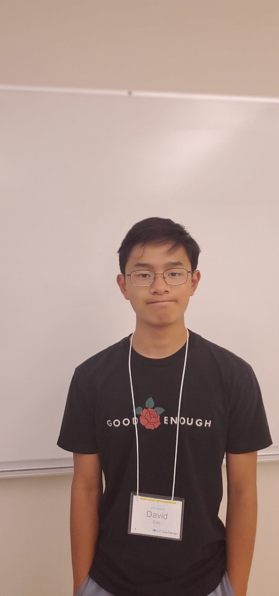

# practice-david-c

Hello, this is David! I'd like to make some lasting friends and a few connections on the way, and to (try to) get used to college life...

I've spent my entire life up until now in Fremont - UCSD is my first experience being in SoCal. I used to be really into martial arts, especially during high school - I competed in several competitions and did performances with my martial arts team, and I can still do some acrobatics stuff today! I also used to play piano, and am now attempting to learn how to play the recorder. Outside of academics and extracurriculars, I also enjoy photography and making the occasional video when I can: my Instagram is @pci3 :^).

